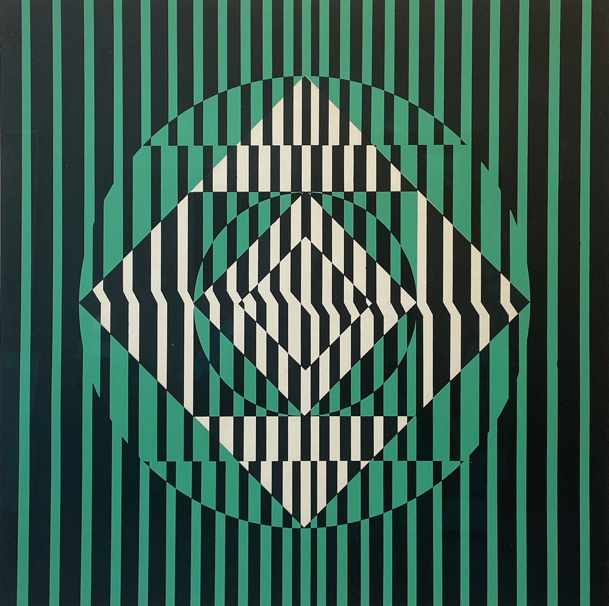

# Pensamiento-Computacional-seccion-3-
## En este repositorio se encuentran todos los ejercicios en clase, tareas, y entrgas del ramo pensamiento computacional
ejercicios y entregas hechos en clase

## Ejercicio clase 1
En este ejercicio aprendimos los comandos basicos de figuras, texto, relleno, fondo, y trazo de [link](https://p5js.org/)

## Avances entrega para solemne
La solemne consta de realizar una obra hecha de formas geometricas en codigo de la pagina p5.js 
La imagen que yo he seleccionado es una obra llamada "Sin título (A)" de la artista chilena Matilde Pérez 

La principal razon por la que elgí esta artista es debido a que en un ramo anterior tuve que investigar sobre ella y por cooincidencia habia asistido a una exposición en la que reunian obras de artistas chilenos,  en ella estaban obras del grupo rectangulo y signo, cuando ivestigue y encontre esta conexción,  me senti muy interesada y motivada con la idea de mejorar la experiencia sensorial a traves del arte como algo que deberia estar en la vida diaria. Sinceramente por eso elegí a la artista,  la razon de mi elección de obra es más que nada porque me gustó mucho y me motivó el reto.

Primero cuando vi la obra pense que en su mayoria usaria el comando "quad' y debido a eso me preocupaba que fuera demasiado simple, aún así la pase a illustrator y con el comando filas y columnas cree una grilla de 70x70 siendo 1:10 la escala entre grilla y pixeles. A partir de ahí me apoyaba para entender las coordenadas, para los colores no tuve mucha complicacion, solo seleccione el color en el mismo archivo illustrator y en la informacion del color decia el codigo, solo use esto con el color verde ya que el color negro es 0 y el blanco es 255.

Lo más dificil fefinitivamente fue adaptarme a las coordenadas, más de una vez me endrede y las ponia al reves, con el tiempo empece a entender y emppece a hacer conexiones entre ellas ya que muchos rectangulos estan conectados por sus esquinas y en vez de contar los cuadrados nuevamente, solo revisaba mi codigo y me basaba en las coordenadas que di anteriormente. Mi otra dificultas fue la limitacion en figuras, por ejemplo el tercer rectangulo de izquierda a derecha tine una parte faltante curva en su mitas derecha, al inicio no tenia idea de como resolver eso pero decidi´continuar mientras pensaba en como resolverlo, cuando llego la clase del dia viernes aun no resolvia eso pero durante la clase me di cuenta de que no estaba sacando probecho del uso de capas en el codigo, por lo que me di cuenta de solo tenia que hacer un circulo del mismo color de fonto que pasara por encima del rectangulo. A partir de ahí me apoye mucho en el uso de capas ya que no debia hacer que los rectangulos quedaran en una cordenada exacta de forma que todas juntas formaran un cuadrado, si podia poner un cuadrado sobre ellas y asi se formaba de manera natural.

Creo que en lo que más me benefició este encargo fue en adaptarme a las herramientas que hay disponibles en el codigo, como pensar en ese lenguaje al ver una obra y en la resulucion de problemas. No creo que sea complejo creo que solo hay que practicar lo suficienta para entenderlo y espero poder seguir mejorando.

